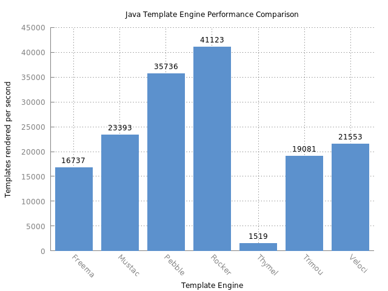

Rocker Templates by Fizzed
=======================================

 - [Fizzed, Inc.](http://fizzed.com) (Follow on Twitter: [@fizzed_inc](http://twitter.com/fizzed_inc))

## Overview

Rocker is a Java 8 optimized, near zero-copy rendering, speedy template engine
that produces statically typed, plain java object templates that are compiled along
with the rest of your project.  No more "warm-up" time in production, slow
reflection-based logic, or nasty surprises that should have been caught during development.

Write your templates using an [intuitive, **tagless** syntax](SYNTAX.md) with standard Java expressions
for logic, iteration, and values. All the heavy lifting is done by the Rocker
parser during development -- which keeps the runtime dependencies down to just a
handful of classes.  Rocker will parse your templates and generate well-documented
Java source files (so you can easily inspect and understand how it works).

## Performance

Based on the following [template benchmark](https://github.com/fizzed/template-benchmark),
Rocker is the clear winner.  ~15% faster than Pebble and ~250% faster than Freemarker
while also using much less memory.



## Two-minute drill

Most templates are used for websites, so here is a quick sample showing how
Rocker templates work and can call each other during the rendering process.
Create a template containing a common header and footer as well as a placeholder
for body content. Template will be `src/main/java/views/main.rocker.html`

    @*
     Example of common header and footer
    *@
    @args (String title, RockerBody content)

    Header with title @title
    @content
    Footer

The template we actually plan on showing to a user will render its content
within the context of the common/header footer. In Java terms, it's passing 
a block of rendering code to be executed within another template. Create template
`src/main/java/views/index.rocker.html`

    @*
     Example of index that uses common header and footer
    *@
    @args (String message)

    @views.main.template("Home") -> {
        Hello @message!
    }

Hey, what about the ```RockerBody content``` argument?  We cover it in more
detail in the [syntax readme](SYNTAX.md), but for now just understand that its
the only special type of argument and instructs Rocker that a template expects
a "body" to be passed to it.

The Rocker parser will generate a Java source file for each template. They
will be `target/generated-sources/rocker/views/main.java` and 
`target/generated-sources/rocker/views/index.java`. In your application, you
can render the index template like so.

```java
static public void main(String[] args) {

    String output = views.index
        .template("World")
        .render()
        .toString();

}
```

The output will equal:

    Header with title Home
        Hello World!
    Footer

Once you generate the Java sources and peek inside the code, it's simple
to see how this works. The views.index class creates a views.main template instance
and handsoff rendering to it -- while also passing a block of itself that
it will render when views.main calls the ```@content``` variable.  The syntax is 
identical to how a lambda is defined in Java 8 -- because it literally is a lambda in 
Java code (implemented with anonymous inner classes in Java 6/7).  Rocker
does a few things behind the scenes to make sure templates that create other
templates share the same rendering context (output buffer, application-specific
context/implicit state).

## Features

 * Templates are runtime compatible with Java 6+.

 * Optimizations enabled when targeting Java 8+ -- using Lambdas and type inference under-the-hood

 * Near zero-copy rendering (see below for details)

 * [Elegant, intuitive, tagless syntax](SYNTAX.md) that infers when your logic ends for control / dynamic
   content.  All dynamic / control code uses standard Java syntax.

 * Parsed templates become normal POJOs with defined arguments -- allowing you
   to tap into your IDEs code completion, syntax highlighting, etc.

 * Support for injecting intermediate application-specific super classes during
   parsing & generating phase  -- thereby creating your own app-specific template engine
   where you can make implicit variables/methods available to all templates.

 * Since templates are just Java classes -- your logic / dynamic content can call
   out to any other Java code. Your templates can be as advanced or as simple as
   you need. No reflection used.

 * No runtime configuration/engine required -- there isn't any sort of RockerEngine
   class required to execute templates.  Each compiled template is ready-to-go
   and knows how to render itself.

 * Templates retain enough information about the original template to throw
   exceptions at runtime (during render()) that let you track down the problematic line
   in the original template source file.

## Near zero-copy rendering

Static (plain text) for each Rocker template is (by default) stored internally as
static byte arrays already converted into your target charset (e.g. UTF-8). When
a template is rendered -- the static byte arrays are reused across all requests.
Rocker renders to an optimized output stream that stores a composite (linked list)
view of the reused byte arrays plus your dynamic content.  Since templates consist
mostly of static content rendered into the same charset over and over again,
rather than allocating new memory, copying that content, and then converting it
into your target charset for each request -- Rocker simply uses a pointer to it
over and over again. This technique produces fast and memory efficient
renders.

Let's say you have a template consisting of 9000 bytes of plain static text
and 1000 bytes of dynamic content.  Without this optimization, it 
would require ~100MB of memory to service 10000 requests (10000 bytes x 
10000 requests).  With this optimization, it would require ~10MB of memory
to service 10000 requests (1000 bytes x 10000 requests).  Besides lower memory,
you also cut out 90MB of memory copies and 90MB of UTF-8 String->byte conversions.
A pretty useful optimization.

## No reflection

Everything is compiled by your project's compiler along with your other Java
source code.  Any dynamic code in your template is ultimately converted into
standard Java and compiled.  No reflection used.

## Hot-reloading?

Almost all template engines for Java attempt to make development easier by
supporting "hot-reloading" of templates (e.g. you change template and it'll be
automatically reloaded on the next request).  While obviously convenient, if
you dig into the internals, you'll notice how supporting this reloading 
strategy was a **major** influence on the overall design from the onset. This
leads to complicated internals and large/slow runtime dependencies.  Many engines
even design their own rules for resolving other templates.

We took the approach to design Rocker w/ little consideration for "hot reloading"
from the onset. We just wanted a clean design for what a template should be.
Rules for resolving other templates use entirely standard Java import statements
for resolution.

Hot-reloading via temporary classloaders is a feature we've been digging into,
but for now we find the [Fizzed watcher maven plugin](https://github.com/fizzed/maven-plugins)
quite sufficient to trigger recompiles as you change code.

## Getting started

Rocker consists of 2 components - the parser/generator and the runtime.  To
use Rocker in your project, add the runtime dependency to your application,
then enable the parser in your build tool followed by creating your first template.

### Add dependency

Rocker is published to Maven central. To add as a dependency in Maven:

```xml
<dependency>
    <groupId>com.fizzed</groupId>
    <artifactId>rocker-runtime</artifactId>
    <version>0.9.0</version>
</dependency>
```

### Integrate parser/generator in build tool

#### Not using maven?

We welcome pull requests / contributions for integrating Rocker into other
build tools.  In the meantime, you may find the command-line parser easy to
integrate.  In the `rocker-compiler` module, you can call 
`com.fizzed.rocker.compiler.JavaGeneratorMain` with the correct
system properties.  Most build tools have some method of executing plain
Java main methods.

#### Maven

For maven, add the following to your pom:

```xml
<build>
    <plugins>
        <plugin>
            <groupId>com.fizzed</groupId>
            <artifactId>rocker-maven-plugin</artifactId>
            <version>0.9.0</version>
            <executions>
                <execution>
                    <id>generate-rocker-templates</id>
                    <phase>generate-sources</phase>
                    <goals>
                        <goal>generate</goal>
                    </goals>
                </execution>
            </executions>
        </plugin>
    </plugins>
</build>
```

By default, Rocker will recursively process any template files ending with
`.rocker.html` in `src/main/java`.  The directory the
template is saved will become the standard Java package the
generated Java classes will be placed into.  The generated Java source files
will be saved to `target/generated-sources/rocker`.  The plugin
will take care of adding this generated directory to your sources root -- thus
no need to use maven-buildhelper plugin.

To customize, the following properties are supported:

 * `templateDirectory` is the base directory to recursively start from
    when locating and parsing template files.  The Java `package`
    a template will be generated to will use this directory as its base.  So
    if you have `${templateDirectory}/views/mytemplate.rocker.html`
    then Rocker will generate `${outputDirectory}/views/mytemplate.java`.
    Defaults to `src/main/java`.

 * `outputDirectory` is the directory the parser will generate sources
    for templates.
    Defaults to `${project.build.directory}/generated-sources/rocker`

 * `failOnError` determines whether any parsing/generating errors cause Maven
    to fail.
    Defaults to true.

 * `skip` determines whether execution of the plugin should be skipped.
    Defaults to false.

 * `touchFile` is the file to "touch" after successfully generating Java sources.
    Useful for triggering other workflow.  Many IDEs will not automatically reload
    generated sources for code completion unless either explicitly told to reload
    OR if the maven pom.xml file is changed. Thus, this value is by default set
    to `${basedir}/pom.xml`.  It's usually harmless to keep this enabled.

 * `skipTouch` disables touchFile.  Defaults to false.

 * `addAsSources` will add the outputDirectory to maven as sources
    to be compiled.  Defaults to true.

 * `addAsTestSources` will adds the outputDirectory to maven as test sources
    to be compiled.  Defaults to false.  If true, this is evaluated before
    addAsSources and effectively tells maven to compile your templates as test
    code.

The following properties are also supported, but it's important to understand
these are essentially passthrough overrides to the parser and they all default
to Rocker's default value.

 * `javaVersion` is the Java version you'd like your templates 
    compile & runtime compatible with.  Defaults to the Java version of the
    JVM executing maven (e.g. "1.8").
 
 * `extendsClass` is the class that all templates should extend.
    Useful for application-specific intermediate classes that you'd like all
    templates to extend.
    Defaults to Rocker's default.
    
 * `discardLogicWhitespace` determines whether whitespace in templates that is
    determined to be only a part of logic/control blocks should be discarded.
    Helps make rendered content look more professional, while still keeping 
    much of your formatting intact.
    Defaults to Rocker's default.
 
 * `targetCharset` is the target charset for template output.
    Defaults to Rocker's default.
   
 * `suffixRegex` is the regular expression to use to find templates to
    parse.
    Defaults to Rocker's default.

### Create first template

The template syntax is described in detail below, but for now create a new
file in `${templateDirectory}/views/HelloWorld.rocker.html`

    @*
     Example of hello world
    *@
    @args (String message)

    Hello @message!

### Use compiled template

Time to compile your project and starting using the template.  You can call it
from java like so:

```java
static public void main(String[] args) {

    String output = views.HelloWorld
        .template("World")
        .render()
        .toString();

}
```

## Ninja framework integration

Looking to integrate Rocker into your own application/framework?  Check out
[Rocker's integration into the Ninja web framework](https://github.com/fizzed/ninja-rocker) for ideas.

## License

Copyright (C) 2015 Joe Lauer / Fizzed, Inc.

This work is licensed under the Apache License, Version 2.0. See LICENSE for details.
